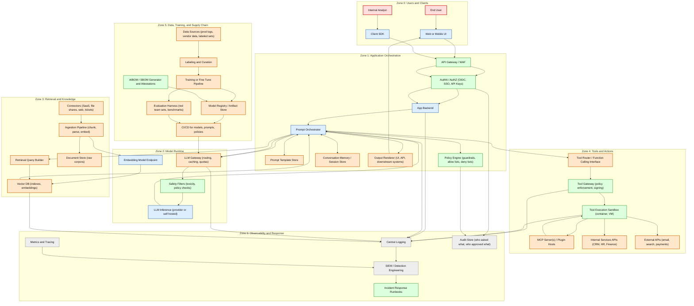

# OWASP AI Attack Surface Framework (AI ASF)

Status: Draft (community bootstrapping)

This project provides a vendor neutral, architecture first method to identify, classify, and document the attack surface of AI systems, including:
- LLM applications
- Retrieval augmented generation (RAG)
- Agentic systems with tool use and action execution
- Classical ML pipelines
- Fine tuning and training pipelines
- Multi tenant inference platforms

The core deliverables are:
- A detailed attack surface taxonomy for AI systems
- Surface Cards (standardized “units” for security review)
- Reference architecture patterns with detailed Mermaid diagrams
- A repeatable “Attack Surface Review” methodology
- Crosswalk mappings to existing OWASP AI resources and external frameworks

Why this exists:
Teams struggle to apply AI security guidance because the architecture decomposition step is missing or inconsistent. This framework standardizes that step so that threat modeling, control selection, testing, and telemetry planning become repeatable and comparable across systems.

## What this project is not
- It is not a new Top 10 list
- It is not a replacement for verification standards (AISVS, LLMSVS, MLSVS)
- It is not a vendor product comparison
- It does not publish weaponized exploit code or step by step offensive instructions
- It does not attempt to solve AI safety as a whole, it focuses on security relevant attack surfaces and controls

## How to use this framework (practitioner workflow)
1. Identify your architecture pattern (or create one from the pattern template)
2. Create an AI Attack Surface Map (ASM) using the template
3. Enumerate surfaces and trust boundaries using the taxonomy and surface cards
4. Map the surfaces to:
   - OWASP Top 10 for LLM Apps 2025
   - OWASP ML Security Top 10
   - AISVS categories
   - OWASP AI Testing Guide layers
   - MITRE ATLAS techniques (optional)
5. Produce a scoped test plan and telemetry plan
6. Re run after major changes (model swap, new tool, new connector, new prompt policies, new memory mode)

Outputs you should produce for every real system:
- Trust boundary diagram
- Data flow diagram
- Privilege flow summary (who can call what, where tokens cross boundaries)
- Surface inventory (list of all interfaces and channels)
- Control mapping and testing plan
- Logging and detection plan
- AI incident response notes (what constitutes an AI security incident for this system)

## Detailed reference diagram (Agentic RAG + tools + training lifecycle)

Paste this diagram into any Mermaid renderer or GitHub Markdown.

## Repo tour

* docs/01-taxonomy: the attack surface taxonomy, trust boundaries, surface cards
* docs/02-methodology: the repeatable process and artifacts
* docs/03-patterns: detailed architecture patterns with per pattern surface inventories
* docs/04-mappings: crosswalks to OWASP and external frameworks
* docs/05-appendices: telemetry guidance, assurance levels, examples, references
* templates: copy and paste templates for contributors and practitioners
* schemas: a machine readable JSON schema for an AI Attack Surface Map
* tools: optional scripts to validate maps and lint mappings
